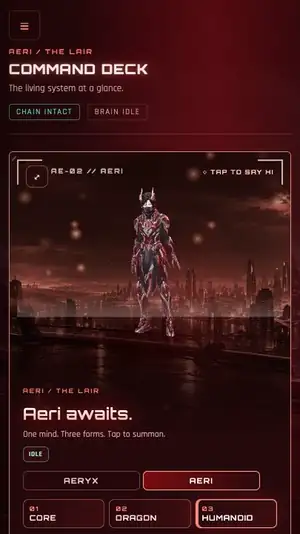
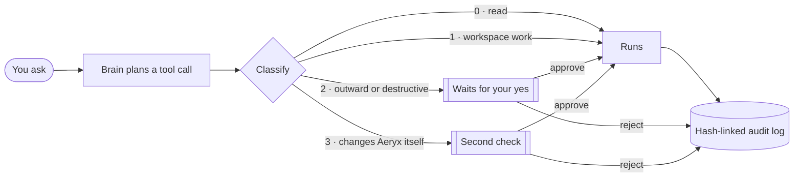
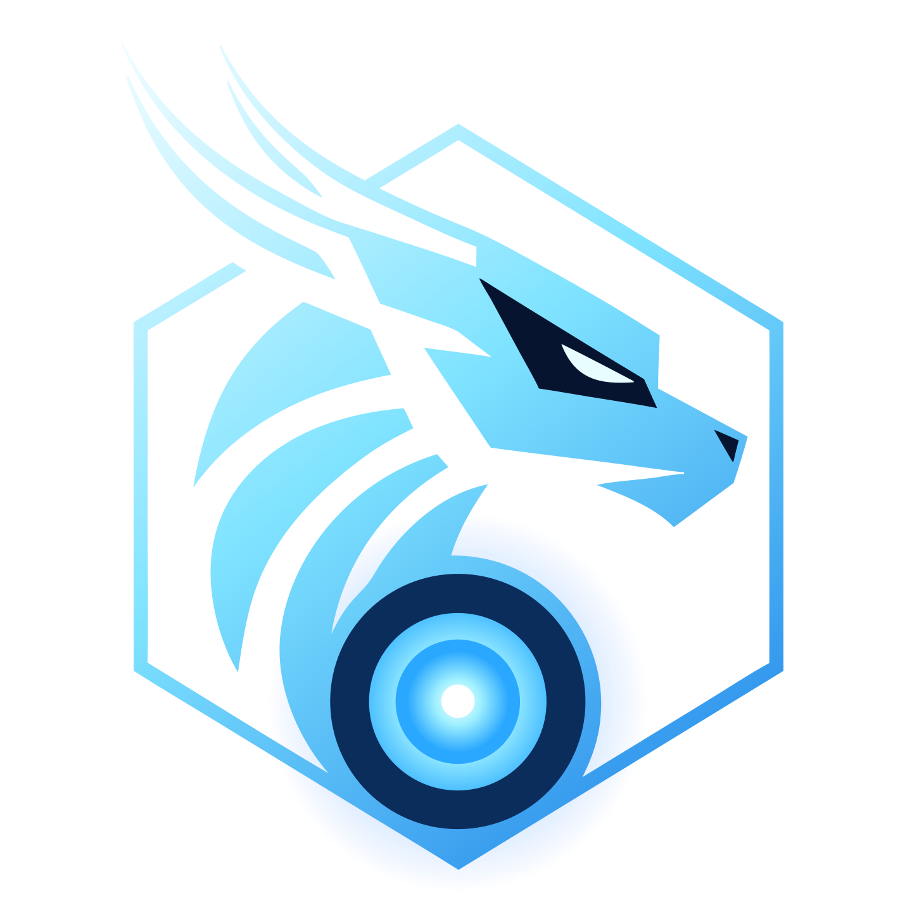

<p align="center"></p>

<p align="center">
  <a href="https://github.com/dracoder/aery-ai/actions/workflows/ci.yml"></a>
  <a href="LICENSE"></a>
  
  
  
  
</p>

<p align="center">
  <a href="https://dracoder.github.io/aery-ai/"><b>Website</b></a> ·
  <a href="#install"><b>Install</b></a> ·
  <a href="#the-chain"><b>The Chain</b></a> ·
  <a href="SECURITY.md"><b>Security</b></a> ·
  <a href="https://github.com/dracoder/aery-ai/discussions"><b>Discussions</b></a>
</p>

<table align="center">
  <tr>
    <td align="center"></td>
    <td align="center"></td>
    <td align="center"></td>
  </tr>
  <tr>
    <td align="center"><sub><b>AERYX</b> · core → dragon → knight</sub></td>
    <td align="center"><sub><b>AERI</b> · the same mind, in red</sub></td>
    <td align="center"><sub>one tap, the whole app re-themes</sub></td>
  </tr>
</table>

<p align="center"><sub>Live captures of the app running locally, with test data and real model replies.</sub></p>

## What it is

Aeryx is an AI assistant that lives on your machine, with a live 3D body: a **core**, a **dragon** and a **humanoid**, as **Aeryx** (blue) or **Aeri** (red). You talk to it in the **Lair**, a web command deck. It plans, runs tasks, sets up routines, reads the news and remembers what you tell it, on the model you choose, local or cloud.

Every action it takes passes **the Chain**. Each one is classified, written to a hash-linked audit log, and anything that matters waits for your yes.

> [!WARNING]
> **Beta, still in active development.** You may hit rough edges, and things will change between releases. A one-line install is provided for macOS, Windows and Linux; it's tested on macOS, and Windows and Linux are checked by CI. Read [SECURITY.md](SECURITY.md) before you give it real access.
>
> Found a problem? [Report a bug](https://github.com/dracoder/aery-ai/issues/new?template=bug.yml) (or run `aeryx report`). Have an idea? [Send feedback](https://github.com/dracoder/aery-ai/discussions/new?category=ideas). Both help shape what comes next.

## Features

| | |
|---|---|
| 🐉 **A body, not a chat box** | A live 3D core, dragon and humanoid that follow your cursor, react while the brain works, and play gestures on request. Pick Aeryx or Aeri and the whole Lair changes colour. |
| 🧠 **Your model** | A local Ollama model, Claude, OpenRouter, or OpenAI's Codex models over OpenRouter. Keys live in the OS keychain, never in the config. |
| 📝 **Its own memory** | The Hoard: plain files on your disk. What you tell it, what it noticed (kept only when you approve), and who it is. Read, edit or delete any of it. |
| 🔁 **Workflows and agents** | Ask for something recurring and it proposes a workflow; build a roster of specialist agents. Both are armed only by you. |
| 🌍 **World signal** | Headlines from public feeds on a globe you can spin, filtered by region and topic. |
| 🎭 **Skins and mods** | Load extra characters on top of Aeryx and Aeri. A skin pack is a zip with its models, colours and gestures: click **+ add skin** in the Lair and pick the zip. It is validated before it installs, lives in your local skins folder, and never replaces the built-in pair. |
| ⛓️ **The Chain** | Classification, a tamper-evident audit log, and approvals for anything outward, destructive or outside your folders. |

## The Chain



- Rows are hash-linked and append-only. Standing permissions are **replayed from that log**, so a broken chain voids every grant and nothing is ever granted silently.
- A standing order (a workflow allowed to act unattended) is armed only by an explicit approval at the machine.
- Anything fetched from the web taints the session: after that the shell, further fetches and drafts ask, and no standing order covers a tainted lane.

## Install

### Download the app

Not a developer? Get the app. Same Aeryx, same features, no terminal:

<p>
  <a href="https://github.com/dracoder/aery-ai/releases/latest/download/Aeryx-macos-universal.dmg"></a>
  <a href="https://github.com/dracoder/aery-ai/releases/latest/download/Aeryx-windows-x64-setup.exe"></a>
</p>

It adds a native window, a tray, a **floating orb** that stays on screen, notifications and **Ctrl+Shift+Space** to call Aeryx from anywhere. Linux app: coming soon.

> [!IMPORTANT]
> The app isn't signed with an Apple or Microsoft certificate yet (the release checksums are signed), so the first launch shows an "unverified developer" warning. [Here's how to open it](docs/DESKTOP.md).

### One-line install

**macOS / Linux**

```bash
curl -fsSL https://dracoder.github.io/aery-ai/install.sh | sh
```

**Windows** (PowerShell)

```powershell
irm https://dracoder.github.io/aery-ai/install.ps1 | iex
```

The installer puts everything in one folder (`~/.aeryx`, or `%LOCALAPPDATA%\Aeryx\runtime`), brings its own checksum-verified Node 20, and needs no admin rights. It then opens the Lair at **http://127.0.0.1:23799/lair/**, where a short first run walks you through choosing a persona, connecting a model (with a live test call) and what the Chain asks. Read the scripts first if you like: [install.sh](site/install.sh), [install.ps1](site/install.ps1).

```text
aeryx start | stop | restart | status | open | logs
aeryx update              # new code; your data, config and tuned guardrails are kept
aeryx autostart on|off    # start at login
aeryx uninstall [--keep-data]
```

> [!TIP]
> Something wrong? `aeryx report` writes a diagnostics file with keys, paths and your user name masked, and opens a prefilled [bug report](https://github.com/dracoder/aery-ai/issues/new?template=bug.yml). Ideas are just as welcome: [send feedback](https://github.com/dracoder/aery-ai/discussions/new?category=ideas).

<details>
<summary><b>From source</b></summary>

You need Node **20** (`.nvmrc` pins it) and git.

```bash
git clone https://github.com/dracoder/aery-ai.git && cd aery-ai
npm install && npm install --prefix lair
npm run build && npm run build:lair
npm run daemon         # http://127.0.0.1:23799/lair/
```

</details>

### Models

| Choice | What you need | Notes |
|---|---|---|
| **Local (Ollama)** | [Ollama](https://ollama.com) with a tool-capable model | Your asks never leave the machine. Small models (3B) can't drive the full tool surface well; prefer `qwen3-coder`, `gpt-oss:20b` or larger. |
| **Claude** | Your Claude Code login, an Anthropic API key, or a `claude setup-token` token | The reference path; the brain is built on the Claude Agent SDK. |
| **OpenRouter** | An OpenRouter key | Uses OpenRouter's Anthropic-compatible endpoint. |
| **Codex** *(experimental)* | An OpenRouter key | OpenAI's Codex models over OpenRouter, so every tool call still passes the Chain. |

Keys are stored by the OS: DPAPI on Windows, the login Keychain on macOS, a `0600` file elsewhere. They never go in `aeryx.config.json`.

<details>
<summary><b>What runs where</b></summary>

| | Windows | macOS | Linux |
|---|---|---|---|
| Daemon, Chain, Lair, 3D characters, conversation, memory, workflows, agents, news | ✅ | ✅ | untested |
| Windows Hello second factor (Class 3, standing orders) | ✅ | fails closed | fails closed |
| Voice and wake word | ✅ | — | — |
| OS account boundary for the brain (`runAs: "warden"`) | ✅ | — | — |

"Fails closed" means anything that needs the second factor is refused rather than asked. `"helloClass3": false` lets you approve Class-3 tool calls in the UI instead. Read SECURITY.md first.

</details>

<details>
<summary><b>Safety defaults</b></summary>

- The daemon binds to `127.0.0.1`. Remote access is off, needs a PIN (8+ characters, not digits only) and is meant for a Tailscale network.
- The brain works in `~/AeryxWorkspace` (set `brain.workspace` to change it). Writes outside it ask.
- Credentials are read-gated: reading `~/.ssh`, `~/.aws`, `.env` files, key files or Aeryx's own secrets always asks.

</details>

<details>
<summary><b>What leaves your machine</b></summary>

- **Your asks:** only to the model provider you chose. With a local model they stay on this machine.
- **Spoken replies:** Microsoft Edge's online text-to-speech. Turn them off with `"ttsEnabled": false`.
- **The news panel:** public RSS feeds. Web tools fetch the pages they need.
- **No telemetry, no crash reports, no account.**
- **Local-only mode** (footer of the Lair): only a local model can be connected, and Aeryx's own network features and known network commands are refused rather than asked. It is not a firewall.

</details>

## In progress

These exist and are being hardened. They'll ship in a later release:

- **Advanced reflexes:** a faster brain layer that answers the obvious instantly and gets quicker the more you use it.
- **Self-growth:** proposing changes to its own code and learning new skills, each drafted separately, tested, and landed only on your approval.
- **Talons:** hands on the screen (see, point, click, type), every act shown first and waiting for your yes.

## Development

```bash
npm run gate       # typecheck + the invariant suite; green before anything is called done
```

The invariants are the guarantees the safety path must never lose. When you touch the Chain, add the invariant first. Live proofs that need a real model or a Windows session are in `scripts/test-*-live.mjs`, deliberately outside the gate.

| Path | What |
|---|---|
| `src/chain/` | The Chain: classification, hash-chained audit, the autonomy ladder |
| `src/brain/` | The brain session (Claude Agent SDK) and providers |
| `src/daemon/` | `aeryxd`: HTTP + SSE, supervision, workflows, agents, news, memory |
| `lair/` | The command deck (Next.js static export) and the 3D characters |
| `skills/` | What Aeryx knows how to do |
| `guardrails.json` | The Chain's tunables (tighten freely, loosen deliberately) |

More in [docs/ARCHITECTURE.md](docs/ARCHITECTURE.md).

## License

The code is licensed under the **GNU AGPL-3.0** ([LICENSE](LICENSE)). The Aeryx name, the dragon mark, the 3D characters (generated with Meshy), the artwork and video are **not** covered by it; see [TRADEMARKS.md](TRADEMARKS.md) and [ASSETS.md](ASSETS.md). Forks are welcome under a different name and look.

Contributions need a signed [CLA](CLA.md) so the project can stay dual-licensable. See [CONTRIBUTING.md](CONTRIBUTING.md).

<p align="center"><br><sub><i>still building</i></sub><br><sub><a href="https://github.com/dracoder">Creator</a> · <a href="https://www.instagram.com/massive.manas.exe/">Instagram</a></sub></p>
